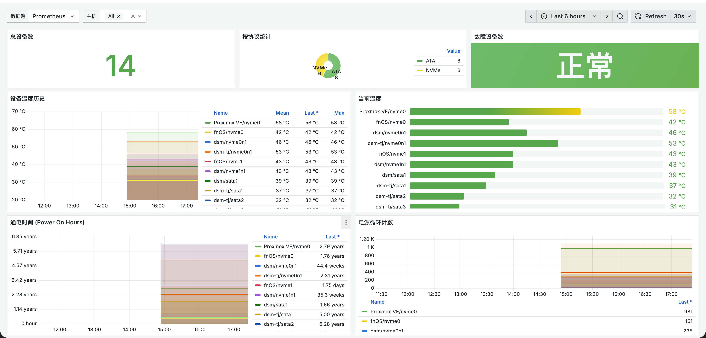
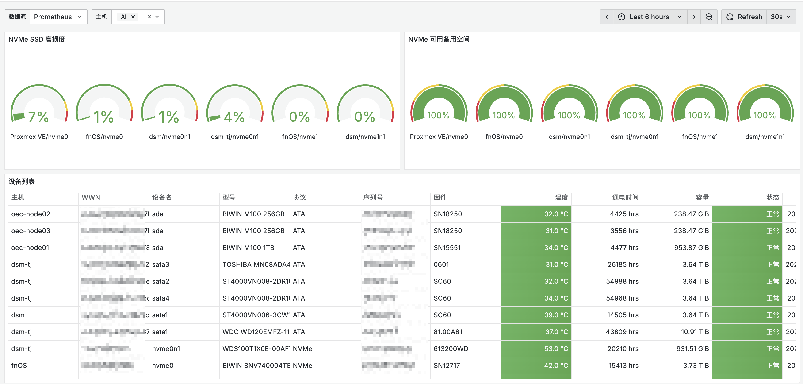

# Scrutiny Prometheus Exporter

Prometheus Exporter for Scrutiny SMART monitoring system. Exports all SMART attributes from Scrutiny API to Prometheus metrics format.

> 📖 [中文文档](README_CN.md) | [English Documentation](README.md)

## Features

- **Complete SMART Attributes Export**: Exports all available SMART attributes for both NVMe and ATA/SATA devices
- **All SMART Fields Covered**: Numeric fields (`raw_value`, `worst`, `thresh`, `failure_rate`, etc.) are exposed as gauges, string fields (`status`, `raw_string`, `when_failed`) are exposed as info metrics
- **Caching Mechanism**: Reduces API calls with configurable cache duration
- **Docker Support**: Ready-to-use Docker image with multi-architecture support (amd64, arm64)
- **GitHub Actions**: Automated Docker image builds with multi-platform support
- **Health Checks**: Built-in health check endpoint

## Quick Start

### Using Docker Compose

```bash
# Clone the repository
git clone <repository-url>
cd exporter

# Build and run
make docker-build
make docker-run

# Check metrics
curl http://localhost:9900/metrics
```

### Using Docker

```bash
docker build -t scrutiny-exporter:latest .
docker run -d \
  -p 9900:9900 \
  -e SCRUTINY_API_URL=https://smart.example.com \
  scrutiny-exporter:latest
```

### Local Development

```bash
# Install dependencies
pip install -r requirements.txt

# Run exporter
python scrutiny_prometheus_exporter.py \
  --api-url https://smart.example.com \
  --port 9900 \
  --cache-duration 60

# Or use Make
make run
```

## Configuration

### Environment Variables (Recommended)

Environment variables have the highest priority and are suitable for use in Docker/Kubernetes:

| Environment Variable | Default | Description |
|---------------------|---------|-------------|
| `SCRUTINY_API_URL` | `https://smart.example.com` | Scrutiny API URL |
| `EXPORTER_PORT` | `9900` | Exporter HTTP port |
| `API_TIMEOUT` | `10` | API request timeout (seconds) |
| `CACHE_DURATION` | `60` | Cache device details (seconds) |
| `LOG_LEVEL` | `INFO` | Log level (DEBUG/INFO/WARNING/ERROR) |

**Docker Compose Example**:
```yaml
environment:
  - SCRUTINY_API_URL=https://smart.example.com
  - EXPORTER_PORT=9900
  - CACHE_DURATION=60
  - LOG_LEVEL=INFO
```

### Command Line Arguments

Command line arguments only take effect when environment variables are not set:

| Argument | Environment Variable | Default |
|----------|---------------------|---------|
| `--api-url` | `SCRUTINY_API_URL` | `https://smart.example.com` |
| `--port` | `EXPORTER_PORT` | `9900` |
| `--timeout` | `API_TIMEOUT` | `10` |
| `--cache-duration` | `CACHE_DURATION` | `60` |
| `--log-level` | `LOG_LEVEL` | `INFO` |

**Local Run Example**:
```bash
python scrutiny_prometheus_exporter.py \
  --api-url http://localhost:8080 \
  --port 9900 \
  --cache-duration 120
```

## Exported Metrics Dictionary

### Device Information Metrics

#### `scrutiny_device_info`
- **Type**: Gauge
- **Description**: Device basic information
- **Labels**:
  - `wwn`: Device WWN (World Wide Name)
  - `device_name`: Device name (e.g., `/dev/sda`)
  - `model_name`: Device model name
  - `serial_number`: Serial number
  - `firmware`: Firmware version
  - `protocol`: Device protocol (`nvme`, `ata`, `sata`, etc.)
  - `host_id`: Host ID
  - `form_factor`: Form factor (`2.5"`, `3.5"`, `M.2`, etc.)
- **Value**: Always `1` (used to identify device existence)
- **Example**:
  ```
  scrutiny_device_info{wwn="5002538e40a22929",device_name="/dev/sda",model_name="Samsung SSD 860",serial_number="S3Z1NX0K123456",firmware="RVT02B6Q",protocol="ata",host_id="host1",form_factor="2.5\""} 1
  ```

#### `scrutiny_device_capacity_bytes`
- **Type**: Gauge
- **Description**: Device capacity in bytes
- **Labels**: `wwn`, `device_name`, `model_name`, `protocol`, `host_id`
- **Unit**: Bytes
- **Example**:
  ```
  scrutiny_device_capacity_bytes{wwn="5002538e40a22929",device_name="/dev/sda",model_name="Samsung SSD 860",protocol="ata",host_id="host1"} 500107862016
  ```

#### `scrutiny_device_status`
- **Type**: Gauge
- **Description**: Device health status
- **Labels**: `wwn`, `device_name`, `model_name`, `protocol`, `host_id`
- **Values**: 
  - `0`: Passed
  - `1`: Failed
- **Example**:
  ```
  scrutiny_device_status{wwn="5002538e40a22929",device_name="/dev/sda",model_name="Samsung SSD 860",protocol="ata",host_id="host1"} 0
  ```

### Summary Metrics

#### `scrutiny_smart_temperature_celsius`
- **Type**: Gauge
- **Description**: Device temperature in Celsius
- **Labels**: `wwn`, `device_name`, `model_name`, `protocol`, `host_id`
- **Unit**: Celsius
- **Example**:
  ```
  scrutiny_smart_temperature_celsius{wwn="5002538e40a22929",device_name="/dev/sda",model_name="Samsung SSD 860",protocol="ata",host_id="host1"} 35
  ```

#### `scrutiny_smart_power_on_hours`
- **Type**: Gauge
- **Description**: Device power on hours
- **Labels**: `wwn`, `device_name`, `model_name`, `protocol`, `host_id`
- **Unit**: Hours
- **Example**:
  ```
  scrutiny_smart_power_on_hours{wwn="5002538e40a22929",device_name="/dev/sda",model_name="Samsung SSD 860",protocol="ata",host_id="host1"} 8760
  ```

#### `scrutiny_smart_power_cycle_count`
- **Type**: Gauge
- **Description**: Device power cycle count
- **Labels**: `wwn`, `device_name`, `model_name`, `protocol`, `host_id`
- **Unit**: Count
- **Example**:
  ```
  scrutiny_smart_power_cycle_count{wwn="5002538e40a22929",device_name="/dev/sda",model_name="Samsung SSD 860",protocol="ata",host_id="host1"} 42
  ```

#### `scrutiny_smart_collector_timestamp`
- **Type**: Gauge
- **Description**: Timestamp of last data collection (milliseconds)
- **Labels**: `wwn`, `device_name`, `model_name`, `protocol`, `host_id`
- **Unit**: Milliseconds (Unix timestamp)
- **Example**:
  ```
  scrutiny_smart_collector_timestamp{wwn="5002538e40a22929",device_name="/dev/sda",model_name="Samsung SSD 860",protocol="ata",host_id="host1"} 1704067200000
  ```

### Complete SMART Attributes Metrics

All SMART attributes are exported with the format:

```
scrutiny_smart_attr_{attribute_id}_{property}
```

Where:
- `attribute_id`: SMART attribute ID (e.g., `available_spare`, `1`, `194`)
- `property`: Any numeric field reported by Scrutiny (e.g. `value`, `raw_value`, `transformed_value`, `worst`, `thresh`, `failure_rate`)

#### Common Attribute IDs

**NVMe Device Attributes**:
- `available_spare`: Available spare percentage
- `available_spare_threshold`: Available spare threshold
- `percentage_used`: Wear percentage
- `critical_warning`: Critical warning
- `temperature`: Temperature
- `media_errors`: Media error count
- `num_err_log_entries`: Number of error log entries

**ATA/SATA Device Attributes**:
- `1`: Raw read error rate
- `5`: Reallocated sector count
- `9`: Power-on hours
- `10`: Spin retry count
- `194`: Temperature (ATA)
- `197`: Current pending sector count
- `198`: Offline uncorrectable sector count
- `199`: UDMA CRC error count

#### Attribute Property Fields

- `value`: Current value (normalized, typically 0-255)
- `raw_value`: Raw value (actual count or numeric value)
- `transformed_value`: Transformed value
- `worst`: Worst value
- `thresh`: Threshold
- `failure_rate`: Failure rate
- `when_failed`: Failure time (string, exported as info metric)

#### Example Metrics

**NVMe Examples**:
```
# Available spare percentage
scrutiny_smart_attr_available_spare_value{wwn="eui.0025385a12345678",device_name="/dev/nvme0n1",model_name="Samsung SSD 980",protocol="nvme",host_id="host1",attribute_id="available_spare"} 100

# Wear percentage
scrutiny_smart_attr_percentage_used_value{wwn="eui.0025385a12345678",device_name="/dev/nvme0n1",model_name="Samsung SSD 980",protocol="nvme",host_id="host1",attribute_id="percentage_used"} 5

# Temperature
scrutiny_smart_attr_temperature_raw_value{wwn="eui.0025385a12345678",device_name="/dev/nvme0n1",model_name="Samsung SSD 980",protocol="nvme",host_id="host1",attribute_id="temperature"} 35
```

**ATA/SATA Examples**:
```
# Reallocated sector count (raw value)
scrutiny_smart_attr_5_raw_value{wwn="5002538e40a22929",device_name="/dev/sda",model_name="Samsung SSD 860",protocol="ata",host_id="host1",attribute_id="5"} 0

# Pending sector count (raw value)
scrutiny_smart_attr_197_raw_value{wwn="5002538e40a22929",device_name="/dev/sda",model_name="Samsung SSD 860",protocol="ata",host_id="host1",attribute_id="197"} 0

# Temperature (current value)
scrutiny_smart_attr_194_value{wwn="5002538e40a22929",device_name="/dev/sda",model_name="Samsung SSD 860",protocol="ata",host_id="host1",attribute_id="194"} 35
```

### String SMART Attributes Metrics

String-only fields (like `status`, `raw_string`, `status_reason`, `when_failed`) are exported as info metrics:

```
scrutiny_smart_attr_{attribute_id}_{property}_info
```

#### Label Description

- Standard device labels: `wwn`, `device_name`, `model_name`, `protocol`, `host_id`, `attribute_id`
- `value`: String value

#### Examples

```
# Status information
scrutiny_smart_attr_critical_warning_status_info{wwn="eui.0025385a12345678",device_name="/dev/nvme0n1",model_name="Samsung SSD 980",protocol="nvme",host_id="host1",attribute_id="critical_warning",value="0"} 1

# Raw string
scrutiny_smart_attr_5_raw_string_info{wwn="5002538e40a22929",device_name="/dev/sda",model_name="Samsung SSD 860",protocol="ata",host_id="host1",attribute_id="5",value="000000000000"} 1
```

**Query Examples**:
```promql
# Find all non-zero critical warnings
scrutiny_smart_attr_critical_warning_status_info{value!="0"}

# Find attributes with failure records
scrutiny_smart_attr_*_when_failed_info{value!=""}
```

### Statistics Metrics

#### `scrutiny_devices_total`
- **Type**: Gauge
- **Description**: Total number of monitored devices
- **Labels**: None
- **Example**:
  ```
  scrutiny_devices_total 5
  ```

#### `scrutiny_devices_by_protocol`
- **Type**: Gauge
- **Description**: Number of devices by protocol
- **Labels**: `protocol` (protocol type: `nvme`, `ata`, `sata`, etc.)
- **Example**:
  ```
  scrutiny_devices_by_protocol{protocol="nvme"} 2
  scrutiny_devices_by_protocol{protocol="ata"} 3
  ```

## Prometheus Configuration

Add to your `prometheus.yml` (refer to `examples/prometheus.yml`):

```yaml
scrape_configs:
  - job_name: 'scrutiny'
    static_configs:
      - targets: ['localhost:9900']
    scrape_interval: 60s  # SMART data updates slowly
    scrape_timeout: 10s
```

## Grafana Dashboard

This project provides a complete Grafana Dashboard for visualizing SMART monitoring data.

### Dashboard Preview





### Features

- **Device Overview**: Total device count, protocol distribution, failure statistics
- **Temperature Monitoring**: Real-time temperature charts and historical trends
- **Usage Statistics**: Power-on hours, power cycle count
- **SSD Health**: NVMe wear level, available spare space
- **Error Tracking**: Critical error metrics for ATA and NVMe
- **Device List**: Comprehensive device information table

### Quick Import

1. Log in to Grafana
2. Click **"+"** -> **"Import"**
3. Upload the `grafana_dashboard.json` file
4. Select Prometheus data source
5. Click **"Import"**

### Detailed Documentation

Complete Dashboard usage guide: [docs/GRAFANA_PANELS.md](./docs/GRAFANA_PANELS.md)

### Dashboard Files

- `grafana_dashboard.json`: Dashboard JSON configuration file
- `docs/GRAFANA_PANELS.md`: Complete Dashboard guide (includes import, configuration, panel details, and usage recommendations)

### Grafana Dashboard Import

Dashboard can be imported in the following ways:

1. **UI Import** (Recommended): Directly import `grafana_dashboard.json` in Grafana UI
2. **Provisioning**: Place Dashboard JSON in Grafana provisioning directory

For detailed instructions, refer to [docs/GRAFANA_PANELS.md](./docs/GRAFANA_PANELS.md).

## Alerting

This project also provides Prometheus alerting rule configurations. Please refer to:
- `examples/prometheus_alerts.yml`: Pre-configured alerting rules
- Includes alerts for temperature, device status, SMART attributes, and other key metrics

## Docker Image

### Build

```bash
make docker-build
```

### GitHub Container Registry

Images are automatically built and pushed to GitHub Container Registry:

```
ghcr.io/jianyun8023/scrutiny-exporter:latest
```

**Pull the latest image**:
```bash
docker pull ghcr.io/jianyun8023/scrutiny-exporter:latest
```

### Multi-Architecture Support

Docker images are built for multiple architectures:
- **linux/amd64**: Intel/AMD 64-bit processors
- **linux/arm64**: ARM 64-bit processors (Apple Silicon, ARM servers)

The images use multi-platform manifests, so Docker will automatically pull the correct architecture for your system.

### Build Triggers

Images are automatically built and pushed when:
- **Manual trigger**: Via GitHub Actions workflow_dispatch
- **Push to branches**: main or master branches
- **Git tags**: Tags matching `v*` pattern (e.g., `v1.2.3`)
- **Pull requests**: Build only (not pushed to registry)
- **GitHub Release**: When a release is published

### Tags

The following tag formats are automatically generated:

- `latest`: Latest build from main/master branch
- `<branch>`: Branch name (e.g., `main`, `master`)
- `<branch>-<sha>`: Branch-specific builds with commit SHA
- `v<version>`: Semantic version tags (e.g., `v1.2.3` → `1.2.3`)
- `<major>.<minor>`: Major and minor version (e.g., `v1.2.3` → `1.2`)
- `pr-<number>`: Pull request builds

### Image Labels

All images include OCI standard labels:
- `org.opencontainers.image.title`: Scrutiny Prometheus Exporter
- `org.opencontainers.image.description`: Prometheus Exporter for Scrutiny SMART monitoring system
- `org.opencontainers.image.vendor`: Repository owner
- `org.opencontainers.image.source`: GitHub repository URL
- `org.opencontainers.image.version`: Git tag or branch name
- `org.opencontainers.image.created`: Build timestamp
- `org.opencontainers.image.revision`: Git commit SHA
- `org.opencontainers.image.licenses`: MIT

## Development

### Testing

```bash
# Run test script
make test

# Or manually
./test_exporter.sh
```

### Local Development

```bash
# Install dependencies
pip install -r requirements.txt

# Run with debug logging
python scrutiny_prometheus_exporter.py --log-level DEBUG
```

## Project Structure

```
exporter/
├── scrutiny_prometheus_exporter.py  # Main application
├── Dockerfile                        # Docker image build
├── docker-compose.yml                # Exporter standalone deployment
├── requirements.txt                  # Python dependencies
├── Makefile                          # Convenience commands
├── test_exporter.sh                  # Test script
│
├── grafana_dashboard.json            # Grafana Dashboard JSON
│
├── docs/                             # Documentation directory
│   └── GRAFANA_PANELS.md             # Complete Dashboard guide
│
├── examples/                         # Example configuration directory
│   ├── env.example                   # Environment variables example
│   ├── prometheus.yml                # Prometheus scrape configuration example
│   └── prometheus_alerts.yml         # Prometheus alerting rules
│
├── README.md                         # Main documentation (English)
├── README_CN.md                      # Main documentation (Chinese)
│
└── .github/workflows/build.yml       # CI/CD workflow
```

## Architecture

### Data Flow

1. Prometheus scrapes `/metrics` endpoint
2. Exporter calls `/api/summary` to get device list
3. For each device, exporter calls `/api/device/{wwn}/details` (with caching)
4. Exporter converts SMART data to Prometheus metrics format
5. Returns metrics to Prometheus

### Caching

- Device details are cached for `--cache-duration` seconds (default: 60s)
- Reduces API calls when multiple Prometheus instances scrape simultaneously
- Cache is thread-safe using locks

## Performance

- **API Calls**: 1 (summary) + N (device details, cached)
- **Recommended Scrape Interval**: 60 seconds (SMART data updates slowly)
- **Cache Duration**: 60 seconds (configurable)

## Troubleshooting

### Exporter not starting

Check logs:
```bash
# Docker
docker logs scrutiny-exporter

# Local
tail -f /tmp/scrutiny_exporter.log
```

### No SMART attributes in metrics

- Check if Scrutiny API is accessible
- Verify device details API returns data
- Check exporter logs for errors
- Wait for cache to expire and retry

### High API call rate

- Increase `--cache-duration` (e.g., 120 seconds)
- Reduce Prometheus scrape frequency
- Use multiple Prometheus instances with shared cache

## License

MIT License

## Contributing

Contributions are welcome! Please open an issue or submit a pull request.

## Support

For issues and questions:
- GitHub Issues: [Create an issue](https://github.com/jianyun8023/scrutiny-exporter/issues)
- Documentation: See this README

